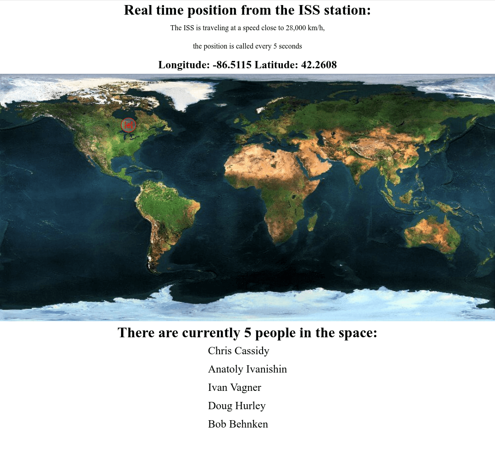

# ISS position

In this project I use the [Open Notify](http://open-notify.org/) API to get the position of the ISS.  
I use a map from [Free wor maps](http://www.free-world-maps.com/).  
I this project I fetch the longitude and the latitude of the position and transfer the position on a map, and I get the names of the people currently in the space station ISS.

